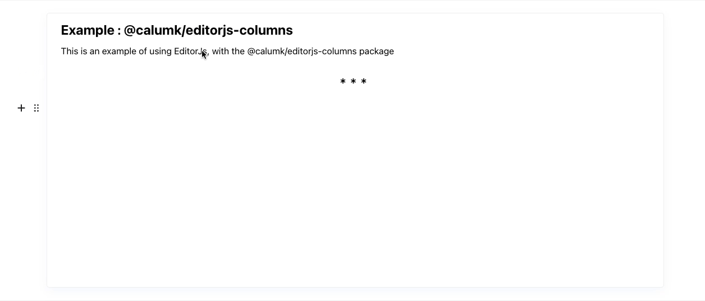

# @calumk/editorjs-Columns

A **BETA** plugin which allows the user to have columns

> Pull requests welcomed!

## Installation


> npm i @calumk/editorjs-columns


> https://cdn.jsdelivr.net/npm/@calumk/editorjs-columns@latest


## Demo



## Features 

* [x] Support new vertical menu style
* [x] Save/Load
* [x] Support for 2 colums
* [x] Support for 3 columns
    * [x] Migrate storage to array
    * [x] Add tool to change type
    * [x] Added tool to switch/roll arrays
* [ ] Refactor code for legibility
* [ ] Tests


## ChangeLog

> 28/04/23 - Re-added feature - EditorJs must now be passed as instance through tool to child, to avoid duplicate editorjs installs, and ensure only one editor js instance is used.
> 16/05/22 - Removed global tool varable. Switched to config variable for column tools (see Example)
> ~~22/05/22 - EditorJs must now be passed as instance through tool to child, to avoid duplicate editorjs installs~~ - Rolled Back 


# Known Bugs
* Pressing enter key inside a column, will exit the column 
    * Can be solved (sort-of) by using @calumk/editorjs-paragraph-linebreakable
* Pressing tab key inside column will launch both column, and parent tools
* Copy/Pasting can cause duplication of data in the wrong place
* ~~z-index issues with toolboxes~~
* ~~Tools are hosted as global var~~
* ~~All Styling is currently only in the example.html~~
    * ~~Column styling should move to plugin~~
    * ~~Opinionaited styling (Borders, rounded corners, hover shaddow) will remain in example.html~~
* ~~SVG logo is not rendering correctly in new vertical menu~~


## Docs
None yet, see example/example.html for useage.


---

> Note : Tools are passed to editorjs-columns using config.tools property

```javascript
// first define the tools to be made avaliable in the columns
let column_tools = {
    header: Header,
    alert : Alert,
    paragraph : editorjsParagraphLinebreakable,
    delimiter : Delimiter
}

// next define the tools in the main block
// Warning - Dont just use main_tools - you will probably generate a circular reference 
let main_tools = {
// Load Official Tools
    header: Header,
    alert : Alert,
    paragraph : editorjsParagraphLinebreakable,
    delimiter : Delimiter,

    columns : {
        class : editorjsColumns,
        config : {
          EditorJsLibrary : EditorJs, // Pass the library instance to the columns instance.
          tools : column_tools // IMPORTANT! ref the column_tools
        }
      },
}


editor = new EditorJS({
    tools : main_tools,
});
```